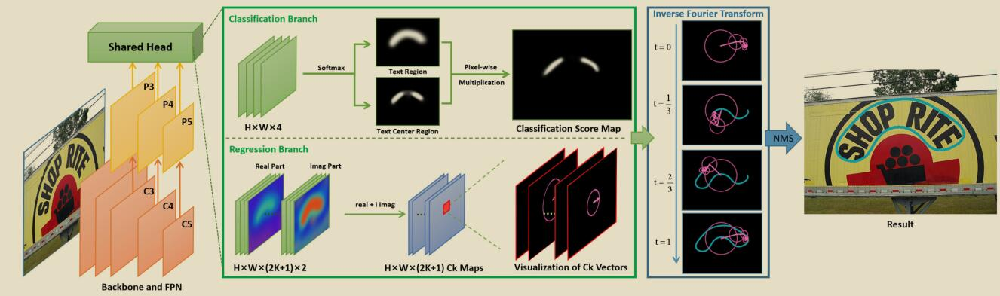

# 论文名称
[**Fourier Contour Embedding for Arbitrary-Shaped Text Detection**](https://arxiv.org/abs/2104.10442)

Yiqin Zhu and Jianyong Chen and Lingyu Liang and Zhanghui Kuang and Lianwen Jin and Wayne Zhang
## 目录

```
1. 简介
2. 数据集和复现精度
3. 开始使用
4. 代码结构与详细说明
```


## 1. 简介




* 论文提出了针对场景文本中的任意形状的文本框利用傅里叶变换进行建模的方法，骨干网络采用了ResNet+FPN的架构。针对Head部分，FCENet具有两个分支，其中分类分支预测文本区域和文本中心区域的概率图，相乘得到属于文本中心分类的得分图；回归分支则负责预测傅里叶特征向量。算法对文本中心置信度大于阈值的像素点所对应的傅里叶特征向量进行反变换，经过NMS得到最终的检测结果。

* 项目参考MMOCR, 在此非常感谢[mmocr_fcenet](https://github.com/open-mmlab/mmocr/blob/main/configs/textdet/fcenet/README.md)，提高了本repo复现论文的效率。

* AI Studio 体验地址（进入后选择v2版本，3221499.ipynb）：

    https://aistudio.baidu.com/aistudio/projectdetail/3221499?contributionType=1
## 2. 数据集和复现精度

[CTW1500](https://github.com/Yuliang-Liu/Curve-Text-Detector)

* 数据集大小：
    * 训练集：1000
    * 验证集：500

* 数据集目录结构：
  ```
    ctw1500/
      └─ imgs/         
          └─ training/             
          └─ test/    
          └─ training.txt
          └─ test.txt 
  ```
* 标注文件格式参考[PaddleOCR](https://github.com/PaddlePaddle/PaddleOCR/blob/release/2.1/doc/doc_en/detection_en.md)，数据集图像及转换好的标注可以从**百度网盘[下载](https://pan.baidu.com/s/1SP8wmWmEja9i22d5Rm_w7A)**，提取码 b8rn

* **复现精度**

  |Backbone|Dataset|Pretrained|BatchSize|Hmean|Config|log
  |:-----:|:-----:|:-----:|:-----:|:-----:|:-----:|:-----:
  |R50_DCNv2|ctw1500|ImageNet(torch)|6|0.854|[det_r50_fce_ctw.yml](configs/det/det_r50_fce_ctw.yml)|[train_log](output/fce_r50_ctw/train.log)

  **预训练模型使用的是Pytorch版本的ResNet50，转换的预训练模型及训练结果权重可以从百度网盘[下载](https://pan.baidu.com/s/1zq25eZU5mGVc0gqHZ_cSDw)，提取码0wkj**

## 3. 开始使用

### 3.1 准备环境

- 框架：
  - PaddlePaddle == 2.2.0
  - PaddleOCR == 2.3

- 克隆本项目：

      git clone https://github.com/zhiminzhang0830/FCENet_Paddle.git
      cd FCENet_Paddle

- 安装第三方库：

      pip install -r requirements.txt


### 3.2 快速开始

  * **模型训练:**（需要首先下载数据集，并在配置文件中修改数据集的路径）
    
        python -m paddle.distributed.launch --gpus '0'  tools/train.py -c configs/det/det_r50_fce_ctw.yml -o Global.pretrained_model='your pretrained model path'

  * **模型验证:**（需要首先下载数据集，并在配置文件中修改数据集的路径）

        python tools/eval.py -c configs/det/det_r50_fce_ctw.yml -o Global.pretrained_model='your model path'

  * **模型推断并可视化结果:**（需要在配置文件中将“infer_img”字段修改为预测图片的路径）

        python tools/infer_det.py -c configs/det/det_r50_fce_ctw.yml -o Global.pretrained_model='your model path'

## 4. 代码结构


    ├─configs
    ├─doc                        
    ├─output                           
    ├─ppocr      
    ├─tools                                            
    │  infer/                     
    │  eval.py                        
    │  export_model.py                        
    │  infer_cls.py                        
    │  infer_det.py                        
    │  infer_e2e.py                        
    │  infer_rec.py                        
    │  infer_table.py                        
    │  program.py                     
    │  test_hubserving.py                   
    │  train.py  
    ├─train.sh 
    ├─requirements.txt
    ├─setup.py 
    ├─README.md       


